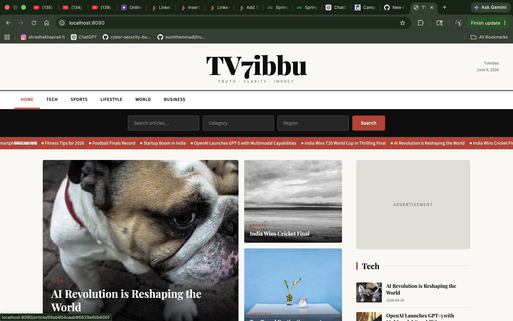

# 📰 TV7ibbu - Modern News Portal

> **A full-stack News Portal Application built with Spring Boot and MySQL, featuring a modern UI, category-based article browsing, and a responsive magazine-style experience.**

<p align="center">
  
  
  
  
  
</p>

---

## ✨ Overview

**TV7ibbu** is a modern full-stack news portal developed using **Spring Boot** and **MySQL**. The platform provides an elegant and responsive interface for browsing articles across multiple categories, delivering a smooth and engaging user experience.

---

## 🚀 Features

* 🗂️ Category-based news browsing
* 🔍 Powerful search functionality
* 📢 Breaking news ticker
* ⭐ Featured articles section
* 📱 Fully responsive user interface
* 📺 Advertisement placement support
* 📝 Dynamic article management
* 🎨 Clean and modern magazine-style layout

---

## 🛠️ Tech Stack

| Category          | Technologies                                  |
| :---------------- | :-------------------------------------------- |
| **💻 Backend**    | Java, Spring Boot, Spring Data JPA, Hibernate |
| **🎨 Frontend**   | HTML5, CSS3, JavaScript, Thymeleaf            |
| **🗄️ Database**  | MySQL                                         |
| **🔧 Build Tool** | Maven                                         |
| **💡 IDE**        | IntelliJ IDEA                                 |

---

## 🏗️ Project Architecture

The project follows the **MVC (Model-View-Controller)** architecture for better maintainability and scalability.

```text
TV7ibbu-News-Portal/
│
├── 📂 controller
├── 📂 service
├── 📂 repository
├── 📂 entity
├── 📂 templates
├── 📂 static
├── 📄 pom.xml
└── 📄 README.md
```

### 📌 Layers

* 🎮 Controller Layer
* ⚙️ Service Layer
* 🗃️ Repository Layer
* 📦 Entity Layer
* 🏛️ MVC Architecture

---

## 📸 Screenshots

## 📸 Project Preview

<p align="center">
  
</p>

## 🌱 Future Enhancements

* 🔐 User Authentication & Authorization
* 👨‍💼 Admin Dashboard
* 💬 Comment System
* 🔖 Bookmark Articles
* 🤖 AI-powered News Recommendations
* 🌐 REST API Integration
* 📊 Analytics Dashboard

---

## 📚 Learning Outcomes

This project helped strengthen my understanding of:

* ☕ Java & Spring Boot Development
* 🏛️ MVC Architecture
* 🗄️ Database Design & MySQL
* 🔄 CRUD Operations
* 🔗 Frontend-Backend Integration
* 📱 Responsive Web Design
* 📦 Spring Data JPA & Hibernate

---

## 👨‍💻 Author

**Ibrahim Shaik**

* 🎓 B.Tech CSE Student
* 💻 Java & Spring Boot Developer
* 🚀 Passionate about Full-Stack Development and Backend Engineering

---

## ⭐ Support

If you found this project useful or interesting, consider giving it a **⭐ Star** on GitHub. It helps and motivates me to build more open-source projects!
